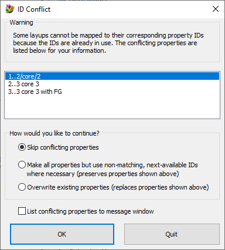
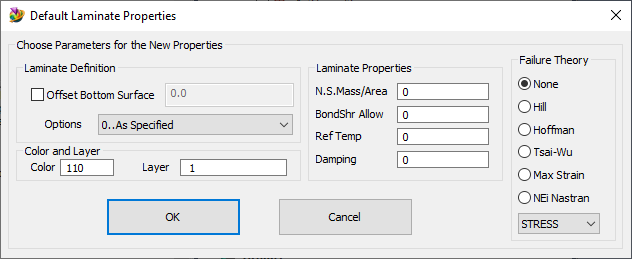

# Femap-Make-Laminate-Properties-from-Layups
Automatically generate properties based on existing layup definitions.

See [How to use Femap Scripts](https://github.com/aaronjasso/How_to_use_Femap_Scripts) if you're unfamiliar with how to run a macro program

Modeling with laminates requires both a laminate definition and a corresponding property definition. After defining the laminates, this program will automatically generate property definitions for each layup you choose (one property for each layup definition). The new properties will have the same title as the corresponding layup definition and (depending on availability and user choice), the same IDs. It's common practice to have matching IDs between the laminates and properties so this will be attempted, but if conflicts are found the user may choose to skip or overwrite them.

`The overwrite can be undone as long as your Undo Levels is at least 1 (Femap Preferences > Database Tab > Database Options section)`

# Instructions
1. Define at least one layup and run this program.

2. Choose layups which layups to process. Note that all layups are listed, whether or not they're already used in any property cards.

3. If any properties exist with the same IDs as the chosen layups, a dialog will appear prompting you to choose how to handle this ID conflict. The list contains the properties with conflicting IDs.

`If no conflicts are detected, the program skips to step 4`

   * __Skip Conflicting Properties__
   Any layups who's corresponding property ID already exists will be skipped. All non-conflicting properties will still be generated.
   
   * __Make all properties but use non-matching, next available IDs...__
   Non-conflicting properties will be made wherever possible. For all remaining layups, properties will be generated that _do not_ match the IDs of their layups. This approach still generates a single property for each chosen layup, but some IDs won't match.
   
   * __Overwrite existing properties...__
   **warning** This method will replace existing properties with layup properties.
   The program will force the new property IDs to match the chosen layup IDs. This is not recommended if the existing properties in the list are not laminate properties. For example, if a bar property is in use elsewhere in your model on a bar element and the property is overwritten with a laminate, the bar element will end up with an incorrect property type.
   
   * __List conflicting properties to message window__
   This is for your reference to view the conflicting properties later. This choice does not affect the model.

4. Choose default parameters for the properties that are about to be generated.

These parameters will be used for each new property, the only difference between property definitions will be the referenced layup and the title (which will be the same as the referenced layup). See the Femap Commands guide, Section 4.2.4.2 "Plane Element Properties" for more information on these parameters.

Clicking OK initiates property creation. At completion, a summary is printed to the message window.
